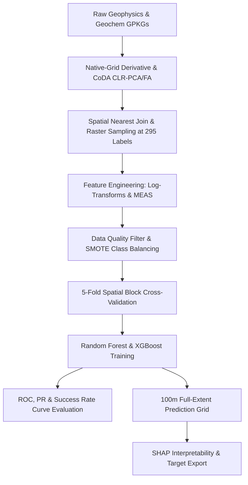

# Methodology

The prospectivity mapping framework is structured as a multi-stage machine learning pipeline, progressing from raw data compilation and grid-derivative computation to spatial machine learning and area-normalized validation. The workflow is divided into five key components: (1) Data Compilation and Native-Grid Preprocessing; (2) Compositional Geochemical Analysis; (3) Feature Extraction and Engineering; (4) Spatial Block Cross-Validation and Model Training; and (5) Full-Extent Mapping and Interpretability.



## Data Compilation and Native-Grid Preprocessing

### Geophysical Datasets
Airborne geophysical grids compiled by Natural Resources Canada (NRCan) over the Bathurst Mining Camp (BMC) were utilized, including Total Magnetic Intensity (TMI), Bouguer gravity, and gamma-ray spectrometric (radiometric) grids (Potassium, % K; Thorium, eTh ppm; Uranium, eU ppm). 

To preserve boundaries and prevent grid distortions caused by spatial resampling, horizontal and vertical derivatives were calculated in the Fourier domain on the original survey grids prior to cell-size transformation (Blakely, 1995):
*   **First Vertical Derivative (FVD):** Computed using a 2D Fast Fourier Transform (FFT) to enhance high-frequency near-surface structural and lithological contacts.
*   **Total Horizontal Gradient (THG):** Derived as:
    $$\text{THG} = \sqrt{\left(\frac{\partial F}{\partial x}\right)^2 + \left(\frac{\partial F}{\partial y}\right)^2}$$
    where $F$ is the magnetic or gravity field intensity, highlighting density and susceptibility contrasts (Verduzco et al., 2004).
*   **Tilt Derivative (TDR):** Calculated to equalize amplitude variations between shallow and deep structural sources:
    $$\text{TDR} = \arctan\left(\frac{\partial F / \partial z}{\text{THG}}\right)$$
    The combination of THG and TDR provides robust edge-detection filters that delineate fault geometries and volcanic contacts (Miller and Singh, 1994).

Radiometric grids were preprocessed to generate radioelement ratios ($K/Th$, $U/Th$, $Th/K$, $U/K$) to map alteration zones characterized by potassic enrichment or thorium depletion (Shives et al., 1997).

### Geochemical Datasets
Till geochemistry point data was compiled from 17 separate single-element databases (Ag, As, Ba, Bi, Cd, Co, Cu, Fe, In, Mn, Mo, Ni, Pb, Sb, Sn, Tl, Zn) covering the BMC. Because coordinate coordinates varied slightly across surveys, sample points were aligned by rounding spatial coordinates to the nearest meter, yielding a unified point geochemistry database of **2,753 unique locations**. 

For spatial modeling, geochemical surfaces were generated using Inverse Distance Weighting (IDW) interpolation with a power parameter of 2 and a search neighborhood restricted to the nearest 12 points, outputting 17 single-element surfaces at a 50m cell size.

---

## Compositional Geochemical Analysis

To address the closed nature of compositional geochemical data, concentration values were transformed using the Centered Log-Ratio (CLR) transformation. The CLR transform projects variables from the constrained simplex space ($S^D$) to unbounded real space ($R^D$) relative to the geometric mean of the composition (Aitchison, 1986):
$$\text{clr}(x) = \left[ \ln\left(\frac{x_1}{g(x)}\right), \ln\left(\frac{x_2}{g(x)}\right), \dots, \ln\left(\frac{x_D}{g(x)}\right) \right]$$
where $g(x) = \left(\prod_{i=1}^D x_i\right)^{1/D}$ is the geometric mean of the $D$ geochemical elements (Egozcue et al., 2003). 

Compositional Principal Component Analysis (CLR-PCA) and compositional Factor Analysis (CLR-FA) with varimax rotation were applied to the CLR-transformed IDW surfaces to extract orthogonal multi-element associations representing primary lithological units and hydrothermal alteration footprints (Filzmoser et al., 2009).

---

## Feature Extraction and Engineering

### Spatial Labels and Feature Extraction
The training dataset was built using two primary label groups:
1.  **Positive Labels (VMS Deposits):** 45 known VMS occurrences within the BMC.
2.  **Negative Labels (Barren Areas):** 250 barren drill hole locations.

Features were extracted at these 295 label coordinates. Geophysical and interpolated geochemical grids were sampled at each point. To integrate raw geochemistry, a spatial nearest-neighbor join was performed: for each label point, the closest raw till geochemistry sample location within a maximum search radius of 1,000 meters was matched, appending raw concentration values (Ag, As, etc.) directly to the feature matrix.

### Feature Engineering
Secondary features were engineered to capture mineralization criteria:
*   **Analytic Signal (AS):** Computed for magnetics and gravity to isolate anomaly centers regardless of magnetization/polarization directions.
*   **Log-Transformations:** Applied to all raw and IDW-interpolated geochemical concentration columns to stabilize variance and normalize distributions.
*   **Multi-Element Anomaly Score (MEAS):** A geologically weighted indicator calculated to capture anomalous concentrations of VMS pathfinder elements:
    $$\text{MEAS} = \sum_{i \in \text{pathfinders}} \text{weight}_i \cdot \text{scale}(x_i)$$
    where pathfinder concentrations were normalized and weighted according to their diagnostic association with massive sulfide mineralization.

---

## Spatial Block Cross-Validation and Model Training

### Data Quality Filtering and Imputation
Features containing more than 75% missing (null) values at label locations were excluded from model training to prevent numerical instability. Of the 17 raw geochemical elements, 4 (Bi, In, Tl, Mn) exceeded this threshold and were dropped; the remaining 13 raw elements were retained. Missing values in the retained features were imputed using median values.

### Class Balancing (SMOTE)
To resolve the high class imbalance (45 VMS vs. 250 barren points), the Synthetic Minority Over-sampling Technique (SMOTE) was applied to the minority class (Chawla et al., 2002). SMOTE interpolates between nearest neighbors of the minority class in feature space to synthesize new positive instances, balancing the dataset to **250 positive and 250 negative samples** ($n=500$).

### Spatial Block Validation
To address spatial autocorrelation and prevent spatial data leakage, a 5-fold spatial block cross-validation scheme was implemented (Brenning, 2012). The study area was divided into distinct geographic blocks using spatial clustering. In each cross-validation fold, models were trained on four blocks and validated on the remaining spatial block, ensuring that training and test samples were geographically separated (Roberts et al., 2017).

```
+---------------------------------------+
|  Block 1 (Fold 0) |  Block 2 (Fold 1) |
|      [Test]       |      [Train]      |
+-------------------+-------------------+
|  Block 3 (Fold 2) |  Block 4 (Fold 3) |
|      [Train]      |      [Train]      |
+---------------------------------------+
```

### Classifiers
Random Forest (RF) and Extreme Gradient Boosting (XGBoost) models were trained and hyperparameter-tuned using randomized search over the spatial folds. Random Forest was configured with Gini impurity split criteria (Breiman, 2001), and XGBoost was trained using a binary logistic objective function (Chen and Guestrin, 2016).

### Performance Metrics
Model validation utilized three complementary metrics (Bonham-Carter, 1994):
1.  **Receiver Operating Characteristic (ROC) Area Under Curve (AUC):** Evaluates overall class separation.
2.  **Average Precision (AP):** Evaluates precision-recall trade-offs, which is critical for highly imbalanced base datasets.
3.  **Success Rate (Prediction-Area) AUC:** Evaluates targeting efficiency by plotting the cumulative percentage of VMS deposits discovered against the cumulative percentage of the total area occupied when ordered by prospectivity probability in descending order (Carranza, 2008).

---

## Full-Extent Mapping and Interpretability

The best-performing model was selected to predict prospectivity across a 100m grid covering the entire BMC (953 rows $\times$ 1,253 columns = 1,194,109 cells). The resulting prospectivity raster was exported as a georeferenced GeoTIFF (EPSG:2953) for integration into GIS software.

To resolve the "black box" nature of the machine learning predictions, SHapley Additive exPlanations (SHAP) was applied to the final models (Lundberg and Lee, 2017). SHAP values, based on game theory, calculate the additive contribution of each feature to the final prospectivity score for every individual cell, providing both global feature importance rankings and local explanation plots of structural and geochemical controls on VMS mineral placement.

---

## References

*   **Aitchison, J. (1986).** *The Statistical Analysis of Compositional Data*. Chapman and Hall, London, 416 p.
*   **Blakely, R. J. (1995).** *Potential Theory in Gravity and Magnetic Applications*. Cambridge University Press.
*   **Bonham-Carter, G. F. (1994).** *Geographic Information Systems for Geoscientists: Modelling with GIS*. Pergamon Press, Oxford, 398 p.
*   **Breiman, L. (2001).** Random forests. *Machine Learning*, 45(1), 5-32.
*   **Brenning, A. (2012).** Spatial cross-validation and bootstrap for the assessment of model accuracy in geocomputation. *2012 IEEE International Geoscience and Remote Sensing Symposium*, 5397-5400.
*   **Carranza, E. J. M. (2008).** *Geochemical Anomaly and Mineral Prospectivity Mapping in GIS*. Elsevier.
*   **Chen, T., & Guestrin, C. (2016).** XGBoost: A scalable tree boosting system. *Proceedings of the 22nd ACM SIGKDD International Conference on Knowledge Discovery and Data Mining*, 785-794.
*   **Chawla, N. V., Bowyer, K. W., Hall, L. O., & Kegelmeyer, W. P. (2002).** SMOTE: synthetic minority over-sampling technique. *Journal of Artificial Intelligence Research*, 16, 321-357.
*   **Egozcue, J. J., Pawlowsky-Glahn, V., Mateu-Figueras, G., & Barceló-Vidal, C. (2003).** Isometric logratio transformations for compositional data analysis. *Mathematical Geology*, 35(3), 279-300.
*   **Filzmoser, P., Hron, K., & Reimann, C. (2009).** Principal component analysis for compositional data with outliers. *Environmetrics*, 20(6), 621-632.
*   **Lundberg, S. M., & Lee, S.-I. (2017).** A unified approach to interpreting model predictions. *Advances in Neural Information Processing Systems (NeurIPS 2017)*, 4765-4774.
*   **Miller, H. G., & Singh, V. (1994).** Potential field partners—design of vertical derivative filters and the tilt derivative. *Journal of Applied Geophysics*, 32(2-3), 121-135.
*   **Roberts, D. R., Bahn, V., Ciuti, S., Boyce, M. S., Elith, J., Guillera-Arroita, G., ... & Dormann, C. F. (2017).** Cross-validation strategies for data with temporal, spatial, or phylogenetic structure. *Ecography*, 40(8), 913-929.
*   **Shives, F. M., Charbonneau, B. W., & Ford, K. L. (1997).** The utility of multiparameter airborne gamma-ray spectrometry surveys for mineral exploration. *Airborne Geophysics and Geochemistry—Applications to Mineral Exploration: Proceedings of Exploration*, 97, 725-730.
*   **Verduzco, B., Fairhead, J. D., Green, C. M., & MacKenzie, C. (2004).** New insights into magnetic derivatives for structural mapping. *The Leading Edge*, 23(2), 116-119.
