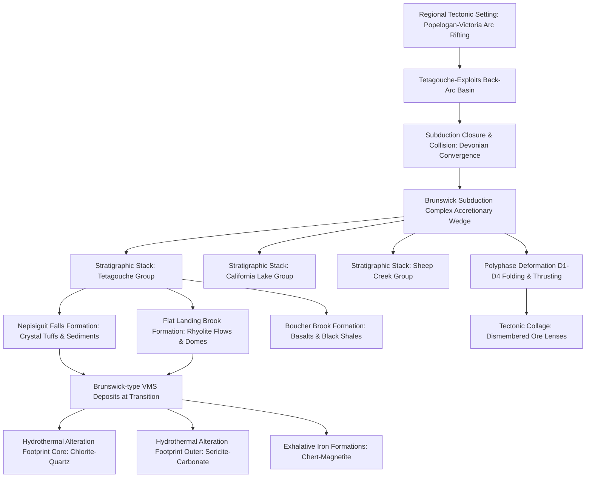

# Geology of the Bathurst Mining Camp (BMC)

This section provides a detailed geological description of the Bathurst Mining Camp (BMC), northern New Brunswick, Canada. It establishes the stratigraphic and structural context that controls the distribution and geometry of the volcanogenic massive sulfide (VMS) deposits and explains the basis for the geophysical and geochemical indicators used in our machine learning pipeline.

---

## 1. Regional Tectonic Setting
The Bathurst Mining Camp is situated within the northern part of the Miramichi Highlands of New Brunswick. It represents a Middle Ordovician volcanic back-arc basin (the Tetagouche-Exploits basin) that formed during the rifting of the Popelogan-Victoria volcanic arc on the Gondwanan active margin (specifically the Ganderian terrane) (van Staal et al., 2003). 

Between the Late Ordovician and Early Silurian, the back-arc basin closed via eastward subduction beneath the Popelogan-Victoria arc. During this subduction process, the volcanic and sedimentary sequences of the back-arc basin were systematically scraped off the subducting plate and stacked into an accretionary wedge known as the **Brunswick subduction complex** (van Staal, 1987). The accretionary wedge was later transported onto the Ganderian basement and subjected to continental collision during the Devonian Acadian orogeny.

---

## 2. Lithostratigraphy
The BMC is composed of several fault-bounded volcanic and sedimentary blocks (thrust nappes or sheets) that represent distinct parts of the back-arc basin. These thrust sheets are grouped into three primary lithostratigraphic assemblages: the **Tetagouche Group**, the **California Lake Group**, and the **Sheep Creek Group** (Goodfellow et al., 2003). 

The Tetagouche Group is the most economically significant unit in the camp, containing the host sequences for the major deposits. Its primary formations include:

1.  **Nepisiguit Falls Formation (~470 Ma):** This formation is the primary host for VMS mineralization in the Tetagouche Group. It is dominated by quartz- and feldspar-phyric volcaniclastic rocks (often referred to as "crystal tuffs" or porphyry) intercalated with quartz-feldspar sandstones, tuffaceous siltstones, and dark shales (Goodfellow and McCutcheon, 2003). These rocks represent pyroclastic flow and debris deposits sourced from active felsic volcanic centers.
2.  **Flat Landing Brook Formation (~466 Ma):** Overlying the Nepisiguit Falls Formation, it consists of aphyric to porphyritic rhyolite flows, rhyolite flow-breccias, hyaloclastites, and domes. These rhyolites represent high-viscosity felsic volcanism that erupted during the peak of rifting. Minor VMS deposits occur within this formation, but the main mineralized horizons sit at or near the stratigraphic contact with the underlying Nepisiguit Falls Formation.
3.  **Boucher Brook Formation:** This unit marks the cessation of active felsic volcanism and is dominated by dark grey-to-black shales, cherts, and alkalic-to-tholeiitic pillow basalts. The transition to mafic volcanism reflects deep crustal rifting and the onset of ocean-floor spreading.

---

## 3. Deformation History and Metamorphism
The structural architecture of the BMC is defined by intense polyphase deformation and greenschist-facies metamorphism (van Staal et al., 2003). Five generations of folding ($D_1$ to $D_5$) have been identified:
*   **$D_1$ Deformation:** Corresponds to subduction-related accretion. It produced progressive thrusting, tight to isoclinal sheath folding ($F_1$), and a pervasive regional schistosity ($S_1$). Large-scale thrust sheets were stacked, repeats of stratigraphy were formed, and VMS deposits were detached from their roots.
*   **$D_2$ Deformation:** Associated with the obduction and docking of the accretionary wedge. It generated tight, upright-to-overturned folds ($F_2$) and a regional cleavage ($S_2$). $D_2$ strain flattened and elongated the VMS deposits, stretching them into plunging, cigar-shaped geometries parallel to $F_2$ fold axes.
*   **$D_3$ and $D_4$ Deformation:** Devonian collisional events that refolded the pre-existing thrust sheets. $D_3$ generated open, upright folds ($F_3$) that produced regional domes and basins, dramatically distorting the spatial footprint of the camp.
*   **Metamorphism:** Metamorphic grades range from sub-greenschist (pumpellyite-prehnite) in the north to greenschist (biotite zone) in the south. This metamorphism recrystallized fine-grained massive sulfides, making them coarser and structurally competent.

---

## 4. VMS Mineralization Styles
VMS deposits in the BMC are grouped into two primary classes based on their geological associations:

### 4.1. Brunswick-Type Deposits
Brunswick-type deposits (e.g., Brunswick No. 12, Brunswick No. 6, Heath Steele, Key Anacon) represent the largest and most valuable class. They are characterized by:
*   **Stratigraphic Association:** Positioned at the boundary between the Nepisiguit Falls and Flat Landing Brook formations.
*   **Exhalative Iron Formations:** Spatially associated with prominent oxide-, silicate-, and carbonate-facies iron formations (chert-magnetite, siderite-chlorite). These iron formations act as crucial chemical sediments and marker horizons, reflecting exhalative volcanic activity.
*   **Mineralogy:** Extremely fine-grained mixtures of sphalerite, galena, pyrite, pyrrhotite, and chalcopyrite. The ore bodies typically form massive stratiform lenses underlain by chalcopyrite-rich quartz-pyrrhotite stockwork zones.

### 4.2. Caribou-Type Deposits
Caribou-type deposits (e.g., Caribou, Restigouche) are hosted within the California Lake Group. They differ from Brunswick-type deposits by:
*   Being hosted in black shales and felsic volcaniclastic sequences lacking the thick crystal-tuff packages.
*   Lacking the prominent oxide-facies iron formations, instead showing association with barite-rich exhalites.
*   Exhibiting a simpler zinc-lead-rich sulfide mineralogy with low copper and silver concentrations.

---

## 5. Hydrothermal Alteration and Surficial Weathering

### 5.1. Hydrothermal Footprint
VMS mineralizing fluids generated distinct alteration zones in the footwall rocks beneath the massive sulfide lenses:
1.  **Core Alteration Zone:** Characterized by quartz-chlorite-pyrite-pyrrhotite alteration directly beneath the deposits. This zone shows extreme enrichment in iron (\(\text{Fe}\)), magnesium (\(\text{Mg}\)), and copper (\(\text{Cu}\)), with complete depletion of calcium (\(\text{Ca}\)) and sodium (\(\text{Na}\)).
2.  **Outer Alteration Zone:** Characterized by sericite-quartz-carbonate-chlorite alteration. This zone is enriched in potassium (\(\text{K}\)) and pathfinders such as thallium (\(\text{Tl}\)) and barium (\(\text{Ba}\)), which substitute for potassium in sericite grids. This potassium alteration halo is detectable on airborne **radiometric** maps.

### 5.2. Glacial Dispersal and Till Geochemistry
During the Quaternary glaciations, ice sheets advanced over the BMC, eroding the exposed massive sulfide lenses, gossans, and hydrothermal alteration halos. This debris was transported down-ice, creating fan-shaped **glacial dispersal trains** of weathered till. 

The heavy minerals and fine fractions of these tills are enriched in VMS indicator elements—principally copper (\(\text{Cu}\)), lead (\(\text{Pb}\)), zinc (\(\text{Zn}\)), silver (\(\text{Ag}\)), arsenic (\(\text{As}\)), antimony (\(\text{Sb}\)), bismuth (\(\text{Bi}\)), and cobalt (\(\text{Co}\)). Because these element signatures are dispersed hundreds of meters down-ice, they form much larger exploration targets than the deposits themselves, forming the basis for our till geochemistry prospectivity models.

---

## References
*   **Goodfellow, W.D., and McCutcheon, S.R., 2003.** Geologic and genetic attributes of volcanic-associated massive sulfide deposits of the Bathurst Mining Camp, northern New Brunswick. *Economic Geology Monograph 11*, p. 1–18.
*   **Goodfellow, W.D., McCutcheon, S.R., and Peter, J.M. (Eds.), 2003.** *Massive Sulfide Deposits of the Bathurst Mining Camp, New Brunswick, and Northern Maine*. Economic Geology Monograph 11, Society of Economic Geologists, 930 p.
*   **McCutcheon, S.R., and Walker, J.A., 2019.** Great Mining Camps of Canada 7. The Bathurst Mining Camp, New Brunswick, Part 1: Geology and Exploration History. *Geoscience Canada*, v. 46, no. 2, p. 57–84.
*   **van Staal, C.R., 1987.** Tectonic setting of the Bathurst Mining Camp. *Geological Society of America Bulletin*, v. 99, no. 2, p. 217–233.
*   **van Staal, C.R., Wilson, R.A., Rogers, N., Fyffe, L.R., Langton, J.P., McCutcheon, S.R., McNicoll, V., and Ravenhurst, C.E., 2003.** Geology and tectonic history of the Bathurst Mining Camp, New Brunswick. *Economic Geology Monograph 11*, p. 19–34.
