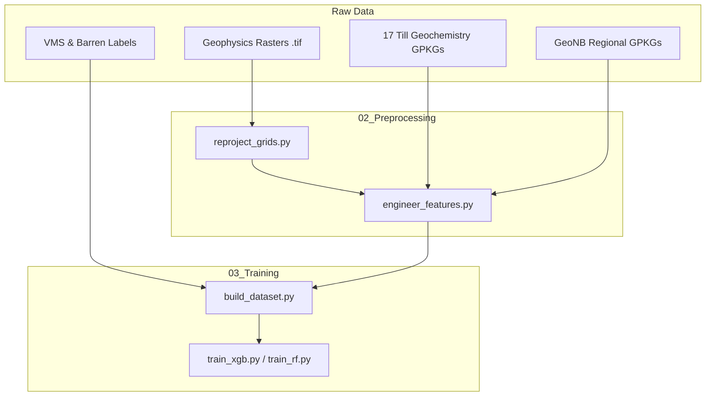

# GeoPackage (GPKG) Dataset Analysis Report
**Project:** VMS Deposit Discovery AI — Bathurst Mining Camp  
**Date:** June 16, 2026  

This report provides a comprehensive review of the **21 GeoPackage (.gpkg)** spatial data files found in this workspace. These files are categorized into:
1. **Regional Geological Data (GeoNB)**: Raw provincial datasets.
2. **Training Labels**: Positive and negative locations for the VMS classification model.
3. **Local Geochemistry (Bathurst Mining Camp)**: High-resolution till geochemistry measurements.

All files use the spatial projection **EPSG:2953** (NAD83(CSRS) / New Brunswick Double Stereographic), which is the standard projected coordinate system for New Brunswick.

---

## 1. Summary of All GPKG Files

| File Path | Layer | Features | Columns | CRS | Geometry | Value Range (Min - Max) | Description |
| :--- | :--- | :--- | :--- | :--- | :--- | :--- | :--- |
| `data\raw\geonb\nb_drill_holes.gpkg` | `drill_holes` | 15,403 | 20 | EPSG:2953 | Point | N/A | Regional New Brunswick drill hole registry. |
| `data\raw\geonb\nb_mineral_occurrences.gpkg` | `mineral_occurrences` | 1,208 | 10 | EPSG:2953 | Point | N/A | Known mineral occurrences/showings. |
| `data\raw\labels\barren_negative_labels.gpkg` | `barren_holes` | 250 | 5 | EPSG:2953 | Point | N/A | Selected barren drill holes (Negative Labels, label `0`). |
| `data\raw\labels\vms_positive_labels.gpkg` | `vms_deposits` | 45 | 5 | EPSG:2953 | Point | N/A | Known VMS deposits (Positive Labels, label `1`). |
| `data\raw\rasters\bmc_Ag.gpkg` | `bmc_Ag` | 7,009 | 23 | EPSG:2953 | Point | 0.0 - 1,200.0 PPM | Silver (Ag) till geochemistry. |
| `data\raw\rasters\bmc_As.gpkg` | `bmc_As` | 3,461 | 23 | EPSG:2953 | Point | 0.0 - 110,000.0 PPM | Arsenic (As) till geochemistry (VMS pathfinder). |
| `data\raw\rasters\bmc_Ba.gpkg` | `bmc_Ba` | 5,007 | 23 | EPSG:2953 | Point | 0.0 - 2,323.0 PPM | Barium (Ba) till geochemistry. |
| `data\raw\rasters\bmc_Bi.gpkg` | `bmc_Bi` | 1,952 | 23 | EPSG:2953 | Point | 0.0 - 360.0 PPM | Bismuth (Bi) till geochemistry. |
| `data\raw\rasters\bmc_Cd.gpkg` | `bmc_Cd` | 2,682 | 23 | EPSG:2953 | Point | 0.0 - 110.0 PPM | Cadmium (Cd) till geochemistry. |
| `data\raw\rasters\bmc_Co.gpkg` | `bmc_Co` | 6,223 | 23 | EPSG:2953 | Point | 0.0 - 420.0 PPM | Cobalt (Co) till geochemistry. |
| `data\raw\rasters\bmc_Cu.gpkg` | `bmc_Cu` | 3,737 | 23 | EPSG:2953 | Point | 0.0 - 1,900.0 PPM | Copper (Cu) till geochemistry (VMS primary metal). |
| `data\raw\rasters\bmc_Fe.gpkg` | `bmc_Fe` | 4,101 | 23 | EPSG:2953 | Point | 0.0 - 309.0 PPM | Iron (Fe) till geochemistry. |
| `data\raw\rasters\bmc_In.gpkg` | `bmc_In` | 1,838 | 23 | EPSG:2953 | Point | 0.0 - 37.0 PPM | Indium (In) till geochemistry. |
| `data\raw\rasters\bmc_Mn.gpkg` | `bmc_Mn` | 1,615 | 23 | EPSG:2953 | Point | 19.0 - 5,688.0 PPM | Manganese (Mn) till geochemistry. |
| `data\raw\rasters\bmc_Mo.gpkg` | `bmc_Mo` | 5,006 | 23 | EPSG:2953 | Point | 0.0 - 83.5 PPM | Molybdenum (Mo) till geochemistry. |
| `data\raw\rasters\bmc_Ni.gpkg` | `bmc_Ni` | 6,336 | 23 | EPSG:2953 | Point | 0.0 - 1,600.0 PPM | Nickel (Ni) till geochemistry. |
| `data\raw\rasters\bmc_Pb.gpkg` | `bmc_Pb` | 4,897 | 23 | EPSG:2953 | Point | 0.0 - 30,000.0 PPM | Lead (Pb) till geochemistry (VMS primary metal). |
| `data\raw\rasters\bmc_Sb.gpkg` | `bmc_Sb` | 3,462 | 23 | EPSG:2953 | Point | 0.0 - 410.0 PPM | Antimony (Sb) till geochemistry. |
| `data\raw\rasters\bmc_Sn.gpkg` | `bmc_Sn` | 4,100 | 23 | EPSG:2953 | Point | 0.0 - 100,000.0 PPM | Tin (Sn) till geochemistry. |
| `data\raw\rasters\bmc_Tl.gpkg` | `bmc_Tl` | 1,838 | 23 | EPSG:2953 | Point | 0.06 - 22.0 PPM | Thallium (Tl) till geochemistry. |
| `data\raw\rasters\bmc_Zn.gpkg` | `bmc_Zn` | 5,720 | 23 | EPSG:2953 | Point | 0.0 - 4,400.0 PPM | Zinc (Zn) till geochemistry (VMS primary metal). |

---

## 2. Detailed File Descriptions

### Category 1: Regional Geological Data (GeoNB)
These are downloaded from the Live GeoNB ArcGIS REST Service (New Brunswick Geological Survey). They represent the overall geologic database of the province.

*   #### `nb_drill_holes.gpkg` (15,403 points)
    *   **Description:** The province-wide directory of drill hole collars.
    *   **Key Columns:**
        *   `label`: Collar ID / Name (e.g. `J-3`).
        *   `yeardrille`: Year of drilling (e.g., `1969`).
        *   `length_m`: Drill hole depth/length in meters.
        *   `azimuthtru`, `dip`: Direction and angle of drilling.
        *   `overburden`: Thickness of soil/glacial cover over bedrock.
        *   `surfaceroc`: Rock type encountered at surface (e.g., `CONGLOMERATE`).
        *   `longitude`, `latitude`: Geographic coordinates (WGS84).
        *   `geometry`: Project coordinate point.

*   #### `nb_mineral_occurrences.gpkg` (1,208 points)
    *   **Description:** Known mineral showings, prospects, and deposits mapped in New Brunswick.
    *   **Key Columns:**
        *   `name`: Deposit name (e.g., `New Horton`).
        *   `commoditie`: Listed metals/minerals (e.g., `Ag, Cu`, `Zn, Pb, Cu`).
        *   `min_occr_u`: URL to the official GNB Mineral Occurrence Database card.

---

### Category 2: Machine Learning Training Labels
These datasets serve as target labels for our binary classification models (e.g. Random Forest, XGBoost) to predict VMS prospectivity.

*   #### `vms_positive_labels.gpkg` (45 points)
    *   **Description:** Confirmed Volcanogenic Massive Sulfide (VMS) deposits within the study area.
    *   **Key Columns:**
        *   `deposit_name`: Name of the deposit (e.g., `Brunswick No. 12`, `Key Anacon`).
        *   `notes`: High-level descriptions (e.g., `World-class; 230 Mt @ 8.0% Zn`).
        *   `label`: Set to `1` (positive class).
        *   `buffer_geom_wkt`: A 500-meter buffer polygon around the deposit center point used to map local influence.

*   #### `barren_negative_labels.gpkg` (250 points)
    *   **Description:** Selected drill holes that did not intercept any significant economic mineralization (barren holes).
    *   **Key Columns:**
        *   `deposit_name`: Label identifier (e.g., `BH-001`).
        *   `label`: Set to `0` (negative class).
        *   `buffer_geom_wkt`: A 500-meter buffer polygon.

---

### Category 3: Bathurst Mining Camp Till Geochemistry
These 17 files represent geochemical assays from glacial till samples collected in the Bathurst Mining Camp. In glaciated terrains, till geochemistry is critical because glaciers eroded outcrops of massive sulfide deposits and dispersed them down-ice, creating geochemical "plumes" or dispersal trains.

*   **Schema Consistency:** All 17 files share the exact same 23-column schema, describing the collection and assay methodology:
    *   `VALUE`: Concentration of the respective element (mostly in PPM).
    *   `DETECTION_LIMIT`: The minimum detection threshold for the assay method.
    *   `SAMPLE_ID`: Unique field identification for the sample (e.g., `MP940533`).
    *   `MATERIAL_DESC`: The medium sampled (e.g., `lodgement/basal till` or `Till`).
    *   `METHOD_DESC`: Analytical technique used (e.g., `ICP-MS` / `ICP-ES`).
    *   `DIGESTION_SOLUTION_DESC`: Acid digestion used (e.g., `4-acid`, `aqua regia`).
    *   `X`, `Y`, `geometry`: Spatial coordinates.

---

## 3. How These Files Are Used in the AI Pipeline

1.  **Feature Extraction:** Points from till geochemistry (e.g., copper, lead, zinc) are interpolated into continuous grids or matched spatially using nearest-neighbor metrics to serve as features.
2.  **Training Sample Creation:** In `build_dataset.py`, the training points (from `vms_positive_labels.gpkg` and `barren_negative_labels.gpkg`) extract values from the geophysics layers (magnetic, gravity, radiometric derivatives) and the geochemistry grids.
3.  **Model Training:** The tabular dataset is then fed into XGBoost/Random Forest to classify whether a given spatial location matches the signature of a VMS deposit.
