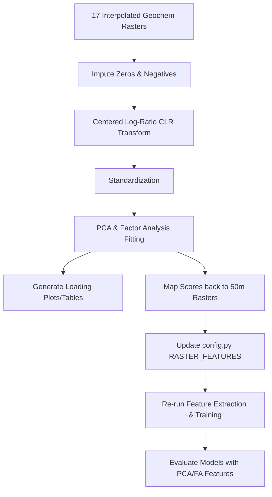

# Geochemistry PCA & Factor Analysis Implementation Plan

Perform unsupervised dimensionality reduction (PCA and Factor Analysis) on the 17 geochemical elements after Centered Log-Ratio (CLR) transformation. Map the scores back to rasters and integrate them as features in the VMS deposit discovery machine learning model.

## Proposed Workflow

## User Review Required

> [!IMPORTANT]
> The PCA and Factor Analysis scores will be appended to the model's feature set (`RASTER_FEATURES`). This is expected to improve model performance and interpretability (e.g. by separating lithology background from hydrothermal alteration). 
> After user approval, we will create the preprocessing script, run it, and re-train the RandomForest and XGBoost models to compare performance.

## Proposed Changes

### Preprocessing & Configuration

#### [NEW] [pca_fa_geochem.py](file:///c:/Users/delef/.gemini/antigravity/bathurst%20VMS/VMS-Deposit-Discovery-AI-Bathurst/pipeline/02_preprocessing/pca_fa_geochem.py)
Creates a new script that:
- Loads the 17 reprojected geochemical rasters (`geochem_ag_ppm_idw.tif`, etc.).
- Identifies valid pixels (non-NoData across all rasters).
- Imputes values $\le 0$ with $0.5 \times$ the minimum positive value for each element.
- Performs a Centered Log-Ratio (CLR) transformation.
- Standardizes the transformed data.
- Fits `PCA(n_components=5)` and `FactorAnalysis(n_components=5)`.
- Prints component loadings and geological interpretations.
- Saves the top 4 PCs and Factors as reprojected GeoTIFFs (e.g. `geochem_pca_pc1_idw.tif`, `geochem_fa_factor1_idw.tif`, etc.).

#### [MODIFY] [config.py](file:///c:/Users/delef/.gemini/antigravity/bathurst%20VMS/VMS-Deposit-Discovery-AI-Bathurst/pipeline/config.py)
- Adds the new PCA and FA score rasters (`geochem_pca_pc1_idw`, `geochem_pca_pc2_idw`, etc.) to `RASTER_FEATURES` so that they are automatically extracted, trained, and used for full extent predictions.

## Verification Plan

### Automated Tests
We will run the pipeline scripts in sequence to verify:
1. `python pipeline/02_preprocessing/pca_fa_geochem.py` creates the GeoTIFF files and displays reasonable element loadings matching geological expectations:
   - PC1 / Factor 1 (Lithology): High loadings on Fe, Mn, Ni, Co (mafic) vs Ba (felsic).
   - PC2 / Factor 2 (VMS Hydrothermal): High loadings on Zn, Pb, Cu, Ag, As, Sb, Tl, Cd.
2. `python pipeline/02_preprocessing/extract_features.py` extracts the new features without errors.
3. `python pipeline/02_preprocessing/engineer_features.py` runs successfully.
4. `python pipeline/03_training/build_dataset.py` builds the new training dataset.
5. `python pipeline/03_training/train_rf.py` and `train_xgb.py` train the models using the new feature set.
6. `python pipeline/04_prospectivity_map/predict_full_extent.py` generates the final prediction map including the new features.

### Manual Verification
- We will review the printed loading coefficients of PCA and FA to verify geological alignment.
- We will compare the cross-validation metrics (ROC-AUC, Average Precision) before and after adding the PCA/FA features.
