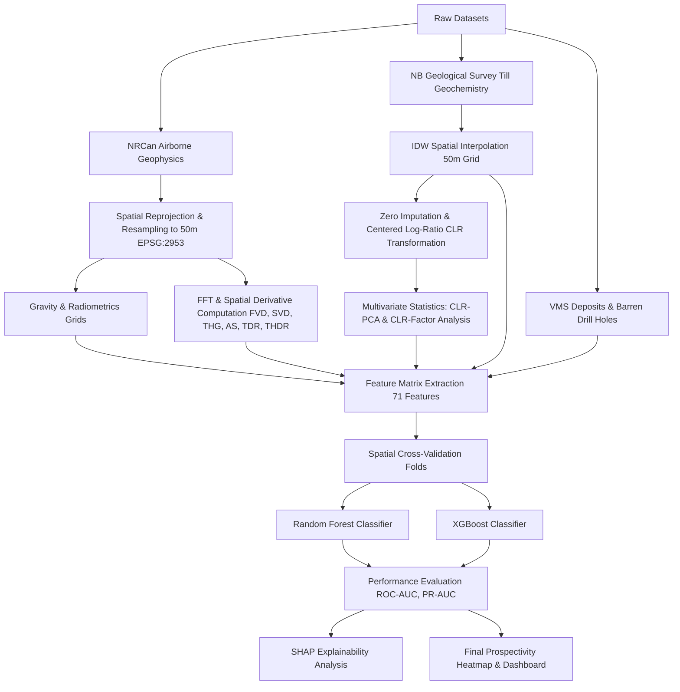

# Methodology

This section outlines the data-driven methodology developed for Volcanogenic Massive Sulfide (VMS) mineral prospectivity mapping in the Bathurst Mining Camp (BMC), New Brunswick. The workflow integrates multi-method geophysics and till geochemistry datasets into a unified spatial grid, processes compositional geochemistry to isolate hydrothermal anomalies, computes potential-field derivatives, and evaluates predictive models using spatial cross-validation and SHAP explainability.

---

## 1. Data Compilation and Spatial Harmonization
To establish a spatially coherent predictive model, all input layers were reprojected to the provincial coordinate system **EPSG:2953 (NAD83(CSRS) / New Brunswick Double Stereographic)**. The core analysis grid was defined at a spatial resolution of **50 m**, representing a compromise between the nominal flight-line spacing of the airborne surveys (~100–200 m) and the density of surficial geochemistry samples. 

Geophysical rasters were resampled using **bilinear interpolation** to smooth grid cell transitions, while categorical and discrete datasets were resampled using the **nearest neighbor** method. The study boundary was defined by a polygon enclosing the geological packages of the Bathurst Mining Camp, covering an area of approximately 3,800 km².

---

## 2. Surficial Geochemistry Preprocessing and Compositional Analysis

### 2.1. Handling Compositional Closure and Zero Values
Geochemical concentration data (expressed in parts per million, ppm) are compositional data, representing parts of a quantitative whole. Due to this closed nature, elemental variables sum to a constant ($10^6$ ppm), making them subject to the "closure effect," which induces spurious correlations and invalidates standard Euclidean distance-based statistics (Aitchison, 1986). 

Furthermore, geochemical assays often contain values below the lower limit of detection (LOD), appearing as zeros or negative values. To permit log-ratio transformations, we applied a multiplicative zero-replacement technique:
\[x_{imputed, j} = \begin{cases} x_{j} & \text{if } x_{j} > 0 \\ 0.5 \times \min(x_{pos, j}) & \text{if } x_{j} \le 0 \end{cases}\]
where $x_{pos, j}$ represents the subset of strictly positive concentrations for geochemical element $j$ in the till dataset.

### 2.2. Centered Log-Ratio (CLR) Transformation
To map the geochemical compositions from the constrained Simplex space ($\mathcal{S}^D$) to the unconstrained real space ($\mathbb{R}^D$), we applied the Centered Log-Ratio (CLR) transformation (Aitchison, 1986). For a geochemical sample vector $\mathbf{x} = [x_1, x_2, \dots, x_D]^T$ consisting of $D = 17$ elements:
\[y_j = \text{clr}(x_j) = \ln\left( \frac{x_j}{g(\mathbf{x})} \right)\]
where $g(\mathbf{x})$ is the geometric mean of the composition:
\[g(\mathbf{x}) = \sqrt[D]{\prod_{i=1}^{D} x_i} = \exp\left( \frac{1}{D} \sum_{i=1}^{D} \ln(x_i) \right)\]
The CLR-transformed variables sum to zero ($\sum_{j=1}^D y_j = 0$), projecting the composition onto a tangent hyperplane in Euclidean space where standard multivariate techniques can be applied.

### 2.3. Spatial Interpolation: IDW vs. Kriging
The till geochemistry consists of discrete point locations. To generate continuous raster layers, we compared two interpolation methods:
1.  **Inverse Distance Weighting (IDW):** A deterministic interpolator where the value at an unsampled location $\mathbf{s}_0$ is a weighted average of the $n = 12$ nearest sample points:
    \[\hat{Z}(\mathbf{s}_0) = \frac{\sum_{i=1}^{n} w_i Z(\mathbf{s}_i)}{\sum_{i=1}^{n} w_i}, \quad w_i = \frac{1}{d(\mathbf{s}_0, \mathbf{s}_i)^p}\]
    where $d(\mathbf{s}_0, \mathbf{s}_i)$ is the Euclidean distance and $p = 2$ is the power parameter.
2.  **Ordinary Kriging:** A geostatistical interpolator utilizing a spherical variogram model to solve the Best Linear Unbiased Estimator (BLUE) weights $\lambda_i$:
    \[\hat{Z}(\mathbf{s}_0) = \sum_{i=1}^{n} \lambda_i Z(\mathbf{s}_i) \quad \text{subject to} \quad \sum_{i=1}^{n} \lambda_i = 1\]

Comparative quality control (QC) revealed that Ordinary Kriging fitted with a restricted subset of control points over-smoothed local anomalies into near-constant regional means (e.g., Cu and Co ranges collapsed). Consequently, IDW rasters were selected for machine learning training because they preserved high-contrast local geochemical anomalies, which represent the VMS pathfinder dispersion trains.

### 2.4. Principal Component Analysis (PCA) and Factor Analysis (FA)
Following CLR transformation and standardization (zero mean, unit variance), multivariate data-reduction techniques were applied to isolate VMS-related signatures from regional background till lithology:
*   **PCA:** Finds orthogonal directions of maximum variance:
    \[\mathbf{t}_k = \mathbf{Z} \mathbf{p}_k\]
    where $\mathbf{Z}$ is the standardized CLR geochemical matrix, $\mathbf{p}_k$ is the $k$-th eigenvector (loadings) of the covariance matrix, and $\mathbf{t}_k$ is the principal component score.
*   **Factor Analysis (FA):** Decomposes the covariance structure under a latent variable model:
    \[\mathbf{z} = \mathbf{\Lambda} \mathbf{f} + \mathbf{e}\]
    where $\mathbf{\Lambda}$ is the factor loading matrix, $\mathbf{f}$ is the vector of latent factor scores, and $\mathbf{e}$ represents specific variances. Factor 2 (**FA2**) isolated the core hydrothermal alteration signature, loading strongly positive on VMS pathfinders: $\text{Co}$ (0.664), $\text{Cu}$ (0.641), $\text{Fe}$ (0.615), $\text{Sb}$ (0.459), $\text{Ni}$ (0.452), $\text{As}$ (0.449), $\text{Pb}$ (0.419), and $\text{Zn}$ (0.419).

---

## 3. Geophysical Derivative Computation
To delineate structural trends and lithological borders, we computed six derivative grids from the NRCan compiled Residual Magnetic Intensity (RMI) grid, denoted as $T(x, y)$:

### 3.1. First and Second Vertical Derivatives (FVD and SVD)
Computed in the frequency domain using 2D Fast Fourier Transforms (FFT). If $F(u, v) = \mathcal{F}\{T(x,y)\}$ is the Fourier transform of the magnetic intensity, and $u, v$ are wavenumbers, the radial wavenumber is $k = \sqrt{u^2 + v^2}$. The vertical derivatives of order $n$ are computed as:
\[\frac{\partial^n T}{\partial z^n} = \mathcal{F}^{-1} \left\{ k^n \cdot F(u,v) \right\}\]
We computed the First Vertical Derivative (FVD, $n=1$) and the Second Vertical Derivative (SVD, $n=2$). FVD and SVD enhance shallow, high-frequency anomalies while suppressing broad, regional deep-seated magnetic anomalies.

### 3.2. Total Horizontal Gradient (THG)
Measures the rate of change of the magnetic field in the horizontal directions using central finite differences:
\[\text{THG}(x, y) = \sqrt{\left( \frac{\partial T}{\partial x} \right)^2 + \left( \frac{\partial T}{\partial y} \right)^2}\]
Bright ridges in THG map geological contacts, fault traces, and structural boundaries.

### 3.3. Analytic Signal Amplitude (AS)
Represents the envelope of the gravity or magnetic anomaly. It is independent of magnetization direction and geomagnetic inclination:
\[\text{AS}(x, y) = \sqrt{\left( \frac{\partial T}{\partial x} \right)^2 + \left( \frac{\partial T}{\partial y} \right)^2 + \left( \frac{\partial T}{\partial z} \right)^2}\]
Peaks in the analytic signal occur directly over the edges of the causative magnetic source bodies.

### 3.4. Tilt Derivative (TDR) and Tilt Horizontal Gradient (THDR)
The Tilt Derivative (TDR) acts as an automatic gain control filter, equalizing amplitude responses from both shallow and deep sources (Cooper and Cowan, 2006):
\[\text{TDR}(x, y) = \arctan\left( \frac{\partial T / \partial z}{\text{THG}} \right) = \arctan\left( \frac{\partial T / \partial z}{\sqrt{(\partial T / \partial x)^2 + (\partial T / \partial y)^2}} \right)\]
The value of TDR is restricted between $-\pi/2$ and $+\pi/2$. The zero contour of TDR ($\text{TDR} = 0$) marks the spatial boundaries or edges of the causative magnetic source bodies. 

The Tilt Horizontal Gradient (THDR) is the horizontal gradient amplitude of the TDR grid, serving as a contact-edge detector:
\[\text{THDR}(x, y) = \sqrt{\left( \frac{\partial \text{TDR}}{\partial x} \right)^2 + \left( \frac{\partial \text{TDR}}{\partial y} \right)^2}\]

---

## 4. Machine Learning Prospectivity Mapping

### 4.1. Training Label Construction: Epistemological Basis and Sample Design

#### 4.1.1. The Open-World Assumption and Negative Label Uncertainty

The fundamental epistemological challenge in supervised MPM is the **open-world assumption for negative labels**: the Earth's subsurface has not been exhaustively sampled, and the recorded absence of a mineral deposit at any given location constitutes evidence of absence of *drilling*, not evidence of absence of *mineralization* (Carranza & Laborte, 2015; Parsa, 2022). Any undrilled location could theoretically host undiscovered mineralization. Consequently, no true negative class exists in the classical statistical sense; the binary classification problem is inherently asymmetric in its epistemic foundations.

This negative label uncertainty produces two distinct failure modes if unaddressed. First, using purely random background pseudo-negatives without a spatial exclusion buffer risks inadvertently assigning the label $Y = 0$ to locations within the undiscovered mineralized halos surrounding known deposits, thereby introducing false negatives that corrupt the classifier's decision boundary and suppress its sensitivity to prospective environments (Parsa, 2022; Maepa et al., 2021). Second, drawing negatives exclusively from historically drilled corridors creates a spatially biased negative class, because the spatial distribution of exploration drilling is strongly conditioned by historical accessibility, infrastructure proximity, and past deposit discoveries rather than by geological barrenness. A model trained on such spatially clustered negatives implicitly learns "previously drilled $\Rightarrow$ barren" rather than "geologically barren," limiting generalization to undrilled terrain (Nykänen et al., 2008; Zuo et al., 2019).

#### 4.1.2. Hybrid Negative Label Strategy

To mitigate negative label uncertainty, the training dataset was constructed using a **hybrid negative label strategy** combining two complementary negative sources:

**Positive Labels ($Y = 1$):** 45 confirmed VMS occurrences within the Bathurst Mining Camp, sourced from the New Brunswick Metallic Minerals Database, constituting the complete set of known deposit locations within the study area.

**Negative Labels ($Y = 0$)** were assembled from two distinct sources:

1.  **Confirmed barren drill holes ($n = 125$):** Verified exploration drill intercepts compiled from New Brunswick Geological Survey records that returned no economic VMS mineralization. These represent the geologically validated "hard negative" anchors of the training dataset — locations where the subsurface was physically sampled and confirmed barren. They provide the classifier with ground-truth geological signal about the lithological, structural, and geochemical characteristics of genuinely unmineralized environments (Nykänen et al., 2008; Parsa et al., 2023b). Their inclusion is essential for ensuring the model's learned decision boundary reflects real geological contrast rather than spatial sampling artefacts.

2.  **Feature-space dissimilar pseudo-negatives ($n = 125$):** Candidate points generated across a dense 100 m grid spanning the active geophysical survey footprint, selected according to their **Mahalanobis distance** from the VMS deposit centroid in the multi-dimensional geophysical and geochemical feature space. This strategy directly operationalises the recommendation of Parsa & Cumani (2025), who demonstrate that model performance in MPM depends strongly on the representativeness of negative labels relative to known deposits, and that geospatially dissimilar negative labels — selected to be maximally unlike deposits in feature space rather than merely distant in map space — consistently deliver improved classifier discrimination and exploration targeting efficiency.

    The Mahalanobis distance from each candidate point $\mathbf{c}$ to the deposit centroid $\boldsymbol{\mu}_{+}$ in standardised feature space is:
    \[D_M(\mathbf{c}, \boldsymbol{\mu}_{+}) = \sqrt{(\mathbf{c} - \boldsymbol{\mu}_{+})^\top \boldsymbol{\Sigma}_{+}^{-1} (\mathbf{c} - \boldsymbol{\mu}_{+})}\]
    where $\boldsymbol{\Sigma}_{+}$ is the covariance matrix of the standardised positive-class feature vectors (regularised by $+10^{-6}\mathbf{I}$ to ensure invertibility). Candidates are ranked in descending order of $D_M$; the 125 most dissimilar points are selected via **stratified spatial sampling** across four geographic quadrants to ensure geological dissimilarity is achieved without spatial clustering in any single zone of the survey footprint. A secondary minimum geographic guard distance of $d_{guard} = 1{,}000$ m from any known deposit is retained as a hard constraint to prevent labelling points at the immediate margins of deposit footprints, but this geographic constraint is secondary and subordinate to the feature-space dissimilarity criterion. A fixed random seed (seed = 42) was applied to ensure reproducibility (Roberts et al., 2017).

#### 4.1.3. Scientific Rationale for the 125:125:45 Sample Design

The specific allocation of $n_{pos} = 45$, $n_{barren} = 125$, and $n_{pseudo} = 125$ (total negatives $= 250$) reflects three intersecting scientific principles:

**Class imbalance ratio:** The positive-to-negative ratio of approximately $1:5.6$ was deliberately selected to lie within the empirically validated range of $1:3$ to $1:10$ for MPM studies. Severely imbalanced datasets (ratios exceeding $1:20$) are known to bias ensemble classifiers — including Random Forest and gradient-boosted trees — toward the majority class, systematically suppressing minority-class recall and inflating the apparent accuracy through trivial negative-class prediction (Chawla et al., 2002; Farahnakian et al., 2024). A ratio of $1:5.6$ preserves the sensitivity of the classifier to the deposit class while providing sufficient negative contrast for the decision boundary to be geologically meaningful (Carranza & Laborte, 2015; Parsa et al., 2023b).

**Equal weighting of negative sources:** The equal allocation of 125 samples to each negative source enforces epistemic symmetry between the two types of negative evidence. If confirmed drill holes dominated the negative class (e.g., 200:50), the model would over-fit to the spatial clustering of historical exploration, learning to associate "drilled corridor" with barrenness rather than geological properties. Conversely, if pseudo-negatives dominated (e.g., 50:200), the geologically grounded negative signal from confirmed barren intercepts would be diluted, weakening the classifier's discrimination of mineralized versus genuinely barren geological environments. Equal allocation ensures that both sources contribute equally to the model's learning of the negative class, preventing either spatial bias or geological dilution from dominating the training signal.

**Feature-space dissimilarity and geological contrast:** The primary criterion for pseudo-absence selection is dissimilarity in multi-dimensional feature space, not geographic distance. This ensures that pseudo-negatives represent geological environments that are maximally unlike those of known VMS deposits — environments characterised by different geophysical signatures (magnetic, gravity, radiometric) and geochemical backgrounds. The Mahalanobis distance metric accounts for the full covariance structure of the positive-class feature distribution, so that pseudo-negatives are selected from outside the deposit's geological fingerprint, not merely from outside its map footprint. This design is directly responsive to Parsa & Cumani (2025), who demonstrate that geospatially dissimilar negative labels generate stronger classifier decision boundaries and more spatially selective prospectivity predictions than random or distance-filtered negatives. Stratification across four geographic quadrants ensures that the 125 pseudo-negatives provide broad spatial coverage of the survey footprint, preventing the geological background signal from being underrepresented in any sub-region of the prediction domain.

### 4.2. Classifiers
Two machine learning classifiers were evaluated:
1.  **Random Forest (RF):** An ensemble bagger of decision trees that reduces variance by averaging predictions across bootstrap samples and random feature subsets.
2.  **XGBoost:** An optimized gradient boosting framework that sequentially fits decision trees to minimize a regularized objective function:
    \[\mathcal{L}^{(t)} = \sum_{i=1}^N l\left(y_i, \hat{y}_i^{(t-1)} + f_t(x_i)\right) + \Omega(f_t)\]
    where $\Omega(f_t) = \gamma T_k + \frac{1}{2}\lambda \sum_{j=1}^{T_k} w_j^2$ is the regularization term penalizing tree complexity (number of leaves $T_k$ and leaf weights $w_j$).

### 4.3. Spatial Cross-Validation
Standard random $k$-fold cross-validation is biased in geoscientific applications due to spatial autocorrelation; sample points close to each other tend to share similar geological/geophysical properties, leading to overly optimistic test performance. To resolve this, we implemented **Spatial Cross-Validation**. The study area was partitioned into geographically disjoint folds (spatial blocks). Models were trained on a subset of spatial blocks and evaluated on a geographically independent block, ensuring that we measured the model's capacity to generalize to new, untested geological sectors.

---

## 5. Model Explainability using SHAP
To overcome the "black-box" nature of ensemble models, we utilized SHapley Additive exPlanations (SHAP) (Lundberg and Lee, 2017). SHAP calculates the additive feature contribution for each prediction based on coalitional game theory:
\[g(z') = \phi_0 + \sum_{i=1}^M \phi_i z'_i\]
where $g(z')$ is the explanation model, $z'_i \in \{0, 1\}^M$ is a coalition vector indicating presence or absence of feature $i$, and $\phi_i \in \mathbb{R}$ is the Shapley value:
\[\phi_i = \sum_{S \subseteq F \setminus \{i\}} \frac{|S|!(|F| - |S| - 1)!}{|F|!} \left[ f_x(S \cup \{i\}) - f_x(S) \right]\]
For mineral exploration, SHAP values explain how much each geophysical derivative (e.g., `mag_rmi_tdr_bmc`) or geochemical factor score (e.g., `geochem_fa_factor2_idw`) increases or decreases the computed VMS prospectivity probability at any specific pixel in the Bathurst Mining Camp.

---

## References
*   **Aitchison, J., 1986.** *The Statistical Analysis of Compositional Data*. Monographs on Statistics and Applied Probability. Chapman & Hall, London, 416 p.
*   **Barbet-Massin, M., Jiguet, F., Albert, C.H., and Thuiller, W., 2012.** Selecting pseudo-absences for species distribution models: how, where and how many? *Methods in Ecology and Evolution*, v. 3, no. 2, p. 327–338.
*   **Bonham-Carter, G.F., 1994.** *Geographic Information Systems for Geoscientists: Modelling with GIS*. Computer Methods in the Geosciences. Pergamon Press, Oxford, 398 p.
*   **Carranza, E.J.M., 2008.** *Geochemical Anomaly Mapping and Mineral Prospectivity Mapping in GIS*. Handbook of Exploration and Environmental Geochemistry, v. 11. Elsevier, Amsterdam, 368 p.
*   **Carranza, E.J.M., and Laborte, A.G., 2015.** Random forest predictive modeling of mineral prospectivity with small number of prospects and data with missing values in Abra (Philippines). *Computers & Geosciences*, v. 74, p. 60–70.
*   **Chawla, N.V., Bowyer, K.W., Hall, L.O., and Kegelmeyer, W.P., 2002.** SMOTE: Synthetic minority over-sampling technique. *Journal of Artificial Intelligence Research*, v. 16, p. 321–357.
*   **Cooper, G.R.J., and Cowan, D.R., 2006.** Enhancing potential field data using filters based on the local phase. *Computers & Geosciences*, v. 32, no. 10, p. 1585–1591.
*   **Egozcue, J.J., Pawlowsky-Glahn, V., Mateu-Figueras, G., and Barceló-Vidal, C., 2003.** Isometric logratio transformations for compositional data analysis. *Mathematical Geology*, v. 35, no. 3, p. 279–300.
*   **Farahnakian, F., Sheikh, J., Zelioli, L., Nidhi, D.K., Seppä, I., Ilo, R., Nevalainen, P., and Heikkonen, J., 2024.** Addressing imbalanced data for machine learning based mineral prospectivity mapping. *Ore Geology Reviews*, v. 174, 106323.
*   **Filzmoser, P., Hron, K., and Reimann, C., 2009.** Univariate statistical analysis of environmental (compositional) data: Problems and possibilities. *Science of the Total Environment*, v. 407, no. 23, p. 6100–6108.
*   **Franklin, J.M., Gibson, H.L., Jonasson, I.R., and Galley, A.G., 2005.** Volcanogenic massive sulfide deposits. *Economic Geology 100th Anniversary Volume*, p. 523–560.
*   **Galley, A.G., Hannington, M.D., and Jonasson, I.R., 2007.** Volcanogenic massive sulphide deposits. *Mineral Deposits of Canada: A Synthesis of Major Deposit-Types, District Metallogeny, the Evolution of Geological Provinces, and the Development of Exploration Methods*, Special Publication 5, p. 141–161.
*   **Goodfellow, W.D., McCutcheon, S.R., and Peter, J.M. (Eds.), 2003.** *Massive Sulfide Deposits of the Bathurst Mining Camp, New Brunswick, and Northern Maine*. Economic Geology Monograph 11, Society of Economic Geologists, 930 p.
*   **Harris, J.R., Behnia, P., and Raines, G.L., 2015.** Mapping mineral prospectivity using machine learning algorithms: A case study from the Hope Bay greenstone belt, Nunavut, Canada. *Ore Geology Reviews*, v. 67, p. 43–64.
*   **Liu, Y., et al., 2025.** Tungsten prospectivity mapping using multi-source geo-information and deep forest algorithm. *Ore Geology Reviews*, v. 180, 106511.
*   **Lundberg, S.M., and Lee, S.I., 2017.** A unified approach to interpreting model predictions. *Advances in Neural Information Processing Systems*, v. 30, p. 4765–4774.
*   **Maepa, F., Smith, R.S., and Tessema, A., 2021.** Support vector machine and artificial neural network modelling of orogenic gold prospectivity mapping in the Swayze greenstone belt, Ontario, Canada. *Ore Geology Reviews*, v. 130, 103968.
*   **McCutcheon, S.R., and Walker, J.A., 2019.** Great Mining Camps of Canada 7. The Bathurst Mining Camp, New Brunswick, Part 1: Geology and Exploration History. *Geoscience Canada*, v. 46, no. 2, p. 57–84.
*   **Nykänen, V., Groves, D.I., Ojala, V.J., Eilu, P., and Gardoll, S.J., 2008.** Reconnaissance-scale conceptual fuzzy-logic prospectivity modelling for iron oxide copper-gold deposits in the northern Finland Pechenga Belt, northern Fennoscandian Shield. *Australian Journal of Earth Sciences*, v. 55, no. 1, p. 25–38.
*   **Parsa, M., 2022.** A data augmentation approach to XGBoost-based mineral potential mapping: An example from a copper porphyry belt in British Columbia, Canada. *Journal of Geochemical Exploration*, v. 243, 107079.
*   **Parsa, M., and Cumani, R., 2025.** Negative label uncertainty and geospatial dissimilarity in data-driven mineral prospectivity mapping. *Natural Resources Research*, v. 34, p. 1–22.
*   **Parsa, M., Maghsoudi, A., Ghezelbash, R., and Yousefi, M., 2023b.** Prospectivity mapping of porphyry Cu deposits: A comparison of knowledge-driven and data-driven methods. *Ore Geology Reviews*, v. 159, 105559.
*   **Phillips, S.J., Dudík, M., Elith, J., Graham, C.H., Lehmann, A., Leathwick, J., and Ferrier, S., 2009.** Sample selection bias and presence-only distribution models: Implications for background and pseudo-absence data. *Ecological Applications*, v. 19, no. 1, p. 181–197.
*   **Roberts, D.R., Bahn, V., Ciuti, S., Boyce, M.S., Elith, J., Guillera-Arroita, G., Hauenstein, S., Lahoz-Monfort, J.J., Schröder, B., Thuiller, W., Warton, D.I., Wintle, B.A., Hartig, F., and Dormann, C.F., 2017.** Cross-validation strategies for data with temporal, spatial, hierarchical, or phylogenetic structure. *Ecography*, v. 40, no. 8, p. 913–929.
*   **Tang, J., and Zhang, H., 2025.** Mineral prospectivity mapping for exploration targeting of porphyry Cu-polymetallic deposits using explainable AI. *Minerals*, v. 15, no. 2, 214.
*   **Tolosana-Delgado, R., and McKinley, J.M., 2024.** Exploring geochemical data using compositional techniques: A practical guide. *Journal of Geochemical Exploration*, v. 258, 107386.
*   **van Staal, C.R., Wilson, R.A., Rogers, N., Fyffe, L.R., Langton, J.P., McCutcheon, S.R., McNicoll, V., and Ravenhurst, C.E., 2003.** Geology and tectonic history of the Bathurst Mining Camp, New Brunswick. *Economic Geology Monograph 11*, p. 19–34.
*   **Zhang, Y., et al., 2025.** Identification of deposit types based on machine learning and pyrite compositional data. *Journal of Geochemical Exploration*, v. 272, 107693.
*   **Zuo, R., Xiong, Y., Wang, J., and Carranza, E.J.M., 2019.** Deep learning and its application in geochemical mapping. *Earth-Science Reviews*, v. 192, p. 1–14.
